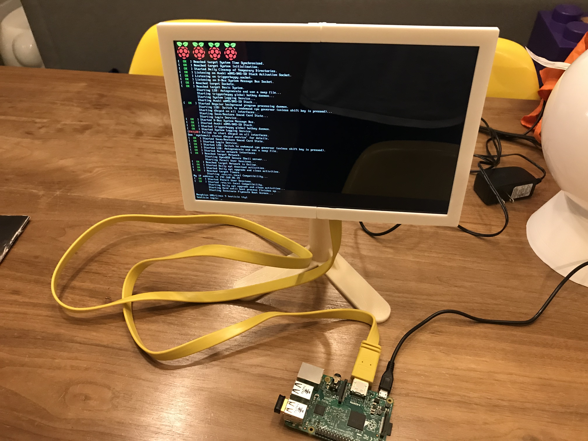
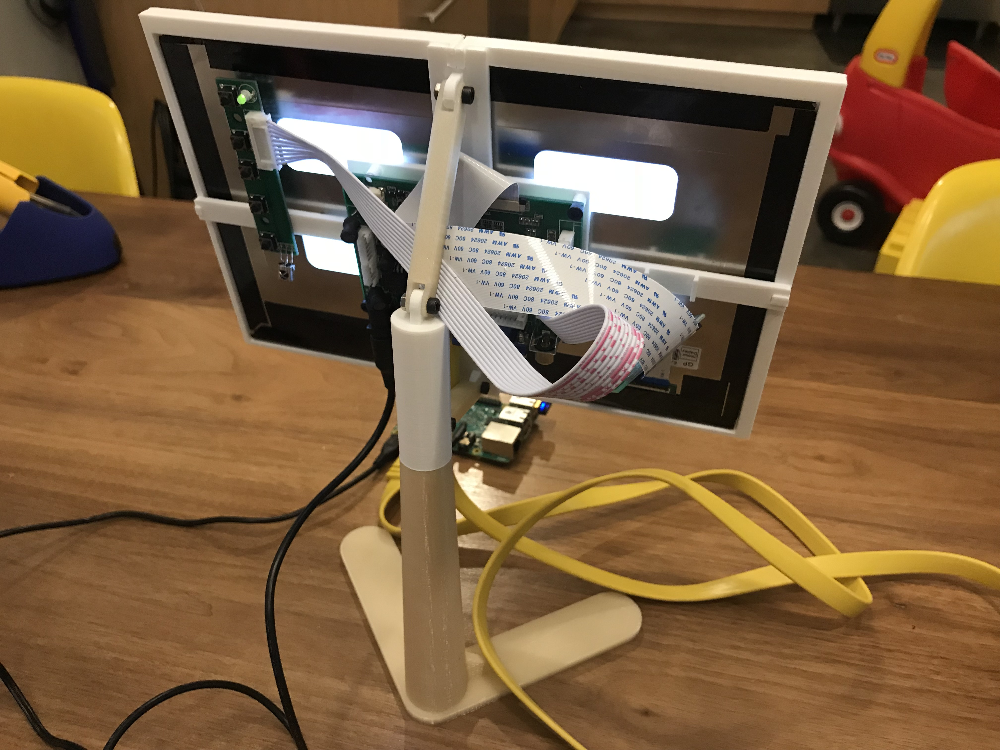
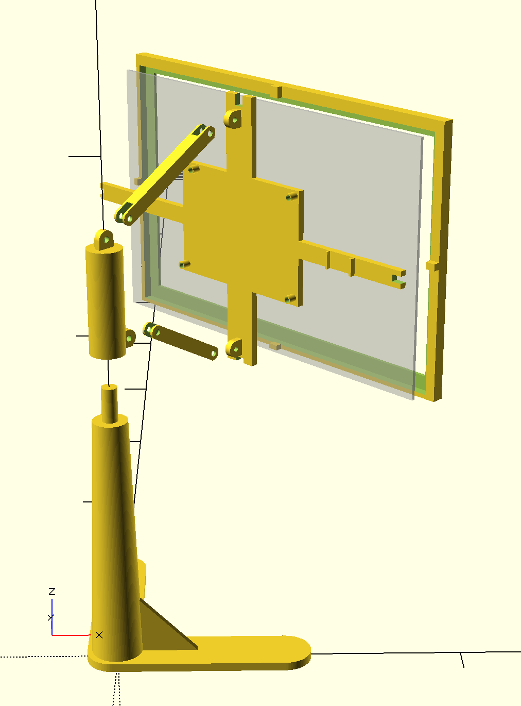
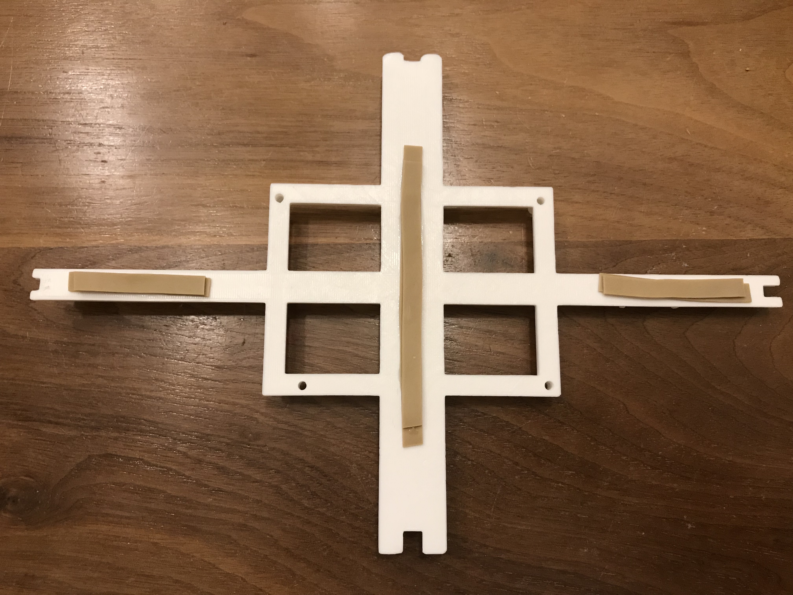

# Mini-Monitor

I wanted a small monitor for setting up Raspberry Pis, and bare 10-inch panels can be had for ~$50.  I purchased this:

http://www.amazon.com/Resolution-1280x800-Raspberry-EJ101IA-01G-Rasbperry/dp/B00S4EWF6G/ref=sr_1_1?ie=UTF8&qid=1440910133&sr=8-1&keywords=jbtek+10&pebp=1440910135520&perid=0W8D878F37HSWKFJ2N2P

And designed a case and stand for it in OpenSCAD.

# Printing

* Printed using an Ultimaker 2+
  * The bezel part was too large to fit on my print bed, so I cut the part in 2 (`mini_monitor_bezel_left.stl` and `mini_monitor_bezel_right.stl`) and glued them together.  I recommend printing the bezel in one piece (`mini_monitor_bezel.stl`) if you can.
* Polymaker Polymax PLA
  * I initially printed in regular PLA, but had some issues with thin parts snapping off.  I recommend a PLA formulated to have a bit more strength like the Polymaker Polymax PLA, or ABS.
* .15mm layer height
* 50% infill
* No brim, lots of glue stick.

# Assembly.

1. Glue the bezel together, if you've printed in 2 parts.
1. Try the panel out, since the next steps involve glue.  You'll want to note:
  1. The orientation of the image on the panel.  Mine is flipped compared to the orientation of the label with text on the back.  You can change in software, but it's annoying to do every time I'm setting up a new Pi.
1. Place the LCD panel in the bezel.  Note that the bezel is offset because the viewable area is offset.  Be sure to matching things up.
1. Screw the LCD controller to the frame using M3 screws.  Note that the screw holes are offset so it only fits one way.
1. Stick or glue some padding to the back of the frame to hold the LCD panel firmly to the bezel.  I cut up a rubber band and glued them on.
   
1. Glue the frame onto the bezel, sandwiching the panel between it and the bezel.
1. Attach the long arm to the top of the frame/LCD/bezel assembly using an M3 screw and nut.
1. Attach the short arm to the bottom of the frame/LCD/bezel assembly using an M3 screw and nut.
1. Snap the button board of the LCD into the clip provided on the frame.
1. Attach the arms to the top piece with M3 screws and nuts.
1. Place the top on the base.  In use, my HDMI cable is heavy enough to swing the monitor around, so I've just glued mine on.
1. Enjoy!
